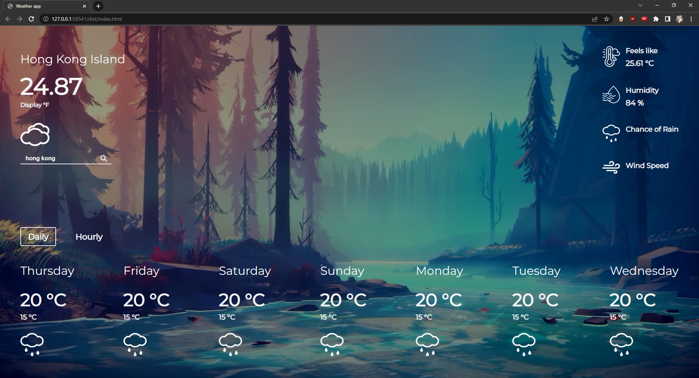

# Weather-app

This is the Weather App project from [The Odin Project](https://www.theodinproject.com/lessons/node-path-javascript-weather-app)  

[Live Demo](https://ascheabl.github.io/Weather-app/) 👈  

## Built with  

#### Technologies  

- HTML  
- CSS  
- Vanilla Javascript  

#### Tools  

- Visual Studio Code  
- Google Fonts  
- Material Design  
- Webpack  

## Outcome  

A working website that shows current weather information based on the input of the user.

## Summary  

#### What I learned  

Originally, I was working on the weather forecast functionality but quickly realized that the free subscription that I use doesn't cover this.  

It's a feature of premium subscription so I couldn't add so much more functionalities.  

#### Author  

- Github: [aScHEABL](https://github.com/aScHEABL)
